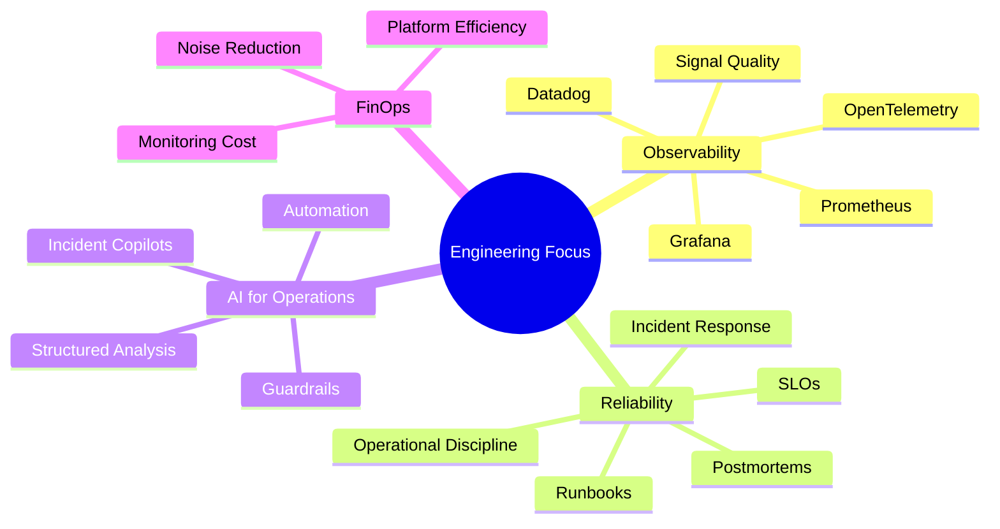

# Luiz Guilherme

### SRE • Observability • Reliability Engineering • FinOps • AI for Operations

I work at the intersection of **observability, incident response, automation and applied AI** — building practical systems that help engineering teams operate with more clarity and less noise.

---

## 👋 About me

I'm Luiz Guilherme, a technology professional focused on **Site Reliability Engineering, Observability and operational excellence**.

My work is guided by a simple idea:

> Reliable systems are not built only with tools. They are built with good signals, clear ownership, disciplined investigation and fast feedback loops.

My current focus is on:

- observability strategy with metrics, logs, traces, events and SLOs;
- incident response practices that separate facts, hypotheses and decisions;
- monitoring cost awareness and FinOps for observability platforms;
- automation that removes repetitive operational work;
- AI copilots that help engineers reason better under pressure.

---

## ✍️ Where I write

My main writing channel today is my **LinkedIn Newsletter**, where I share practical reflections on technology, career, reliability, observability and engineering discipline.

The older blog remains online as a **technical archive** from my career transition journey and early infrastructure content.

- 📨 [Read my LinkedIn Newsletter](https://www.linkedin.com/newsletters/6957793287055261696/)
- 📚 [Visit my technical archive](https://luizguilherme.netlify.app/)

---

## 🧭 Current focus

---

## 🚧 Featured project

### 🧭 Observability Incident Copilot

A lab/portfolio project exploring how AI can support incident triage without replacing engineering judgment.

The MVP receives synthetic observability payloads and generates structured incident analysis with:

- facts separated from hypotheses;
- missing evidence made explicit;
- next investigation steps;
- operational risk summary;
- communication draft;
- postmortem seed.

> Principle: **AI should reduce operational noise, not create false confidence.**

---

## 🛠️ Toolbox

---

## 📌 What I like to build

- Observability workflows that help teams make better decisions.
- Scripts and automations that reduce repetitive operational work.
- Incident response tools focused on clarity, not noise.
- Technical content that teaches practical infrastructure and reliability concepts.
- AI-assisted engineering experiments with clear boundaries and verification.

---

## 📚 Selected archive content

- [Criando uma infraestrutura na AWS com Terraform](https://luizguilherme.netlify.app/posts/2022/08/criando-uma-infraestrutura-na-aws-com-terraform./)
- [Guia de Sobrevivência do Git](https://luizguilherme.netlify.app/posts/2022/06/guia-de-sobreviv%C3%AAncia-do-git./)
- [Comandos Básicos no Terminal Linux](https://www.youtube.com/watch?v=-ypIZJR_Rw0&t=230s)

---

## 📊 GitHub stats

---

### Building reliable systems, useful automation and practical AI for engineering teams.

