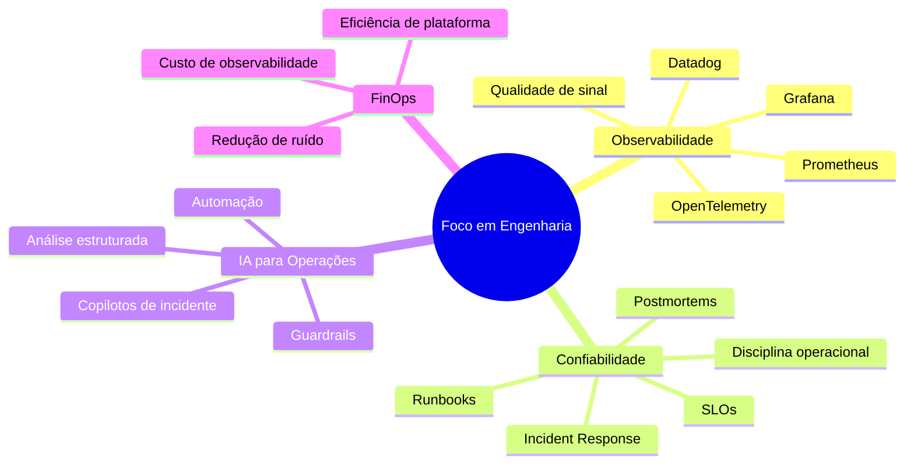

# Luiz Guilherme

### SRE • Observabilidade • Reliability Engineering • FinOps • IA aplicada à operação

Atuo na interseção entre **observabilidade, resposta a incidentes, automação e IA aplicada** — criando sistemas práticos que ajudam times de engenharia a operar com mais clareza, menos ruído e melhores decisões.

---

## 👋 Sobre mim

Sou Luiz Guilherme, profissional de tecnologia com foco em **Site Reliability Engineering, Observabilidade e excelência operacional**.

Minha forma de pensar engenharia parte de uma ideia simples:

> Sistemas confiáveis não nascem apenas de ferramentas. Eles nascem de bons sinais, responsabilidades claras, investigação disciplinada e ciclos rápidos de aprendizado.

Hoje meus principais temas de estudo e atuação são:

- estratégia de observabilidade com métricas, logs, traces, eventos e SLOs;
- resposta a incidentes separando fatos, hipóteses e decisões;
- FinOps aplicado a plataformas de observabilidade;
- automação para reduzir trabalho operacional repetitivo;
- IA aplicada à operação para apoiar análise, triagem e clareza técnica.

---

## ✍️ Onde eu escrevo

Meu canal principal de escrita hoje é minha **newsletter no LinkedIn**, onde compartilho reflexões práticas sobre tecnologia, carreira, confiabilidade, observabilidade e disciplina de engenharia.

O blog antigo permanece online como **arquivo técnico** da minha transição de carreira e dos primeiros conteúdos sobre infraestrutura, Linux, Git, AWS e Terraform.

- 📨 [Ler minha newsletter no LinkedIn](https://www.linkedin.com/newsletters/6957793287055261696/)
- 📚 [Acessar meu arquivo técnico](https://luizguilherme.netlify.app/)

---

## 🧭 Foco atual

---

## 🚧 Projeto em destaque

### 🧭 Observability Incident Copilot

Um projeto de laboratório e portfólio que explora como IA pode apoiar a triagem de incidentes sem substituir o julgamento de engenharia.

O MVP recebe payloads sintéticos de observabilidade e gera uma análise estruturada de incidente com:

- fatos separados de hipóteses;
- evidências ausentes explicitadas;
- próximos passos de investigação;
- resumo de risco operacional;
- rascunho de comunicação;
- semente para postmortem.

> Princípio: **IA deve reduzir ruído operacional, não criar falsa confiança.**

---

## 🛠️ Ferramentas e tecnologias

---

## 📌 O que gosto de construir

- Workflows de observabilidade que ajudam times a tomar decisões melhores.
- Scripts e automações que reduzem trabalho operacional repetitivo.
- Ferramentas de resposta a incidentes focadas em clareza, não em ruído.
- Conteúdo técnico que ensina infraestrutura, confiabilidade e carreira de forma prática.
- Experimentos de IA aplicada à engenharia com limites claros e validação real.

---

## 📚 Conteúdos do arquivo técnico

- [Criando uma infraestrutura na AWS com Terraform](https://luizguilherme.netlify.app/posts/2022/08/criando-uma-infraestrutura-na-aws-com-terraform./)
- [Guia de Sobrevivência do Git](https://luizguilherme.netlify.app/posts/2022/06/guia-de-sobreviv%C3%AAncia-do-git./)
- [Comandos Básicos no Terminal Linux](https://www.youtube.com/watch?v=-ypIZJR_Rw0&t=230s)

---

## 📊 Estatísticas do GitHub

---

### Transformando sinais em decisões operacionais melhores.

